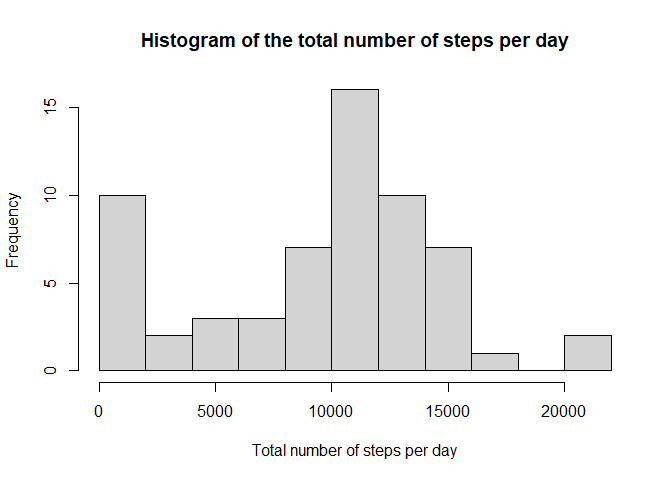
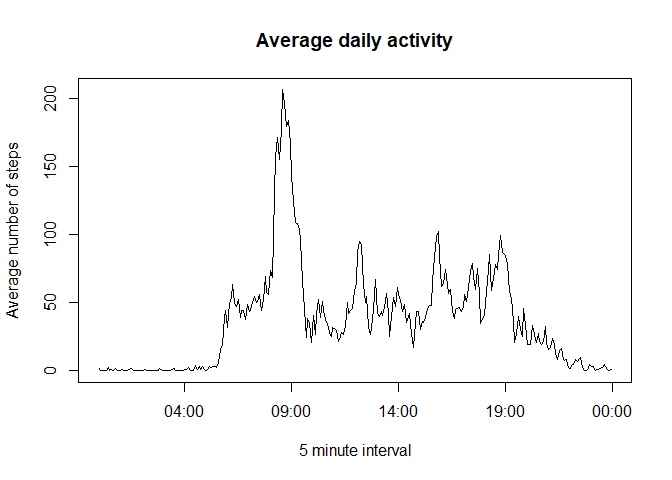
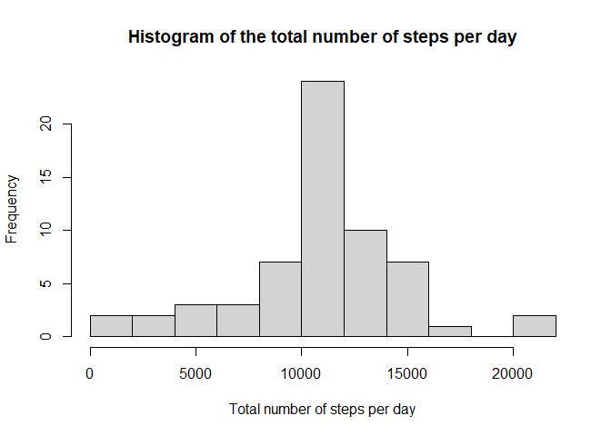
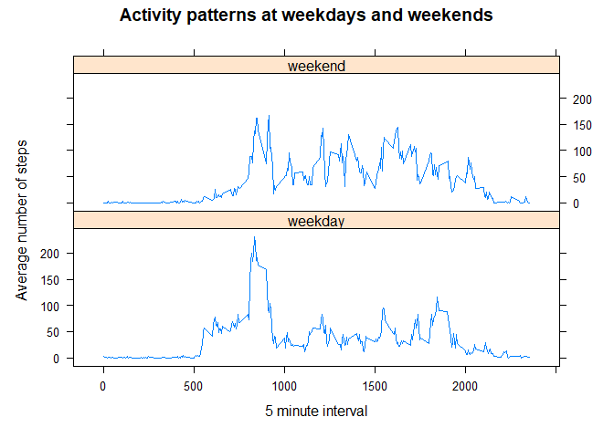

## Loading and preprocessing the data

```r
activity <- read.csv("activity/activity.csv")

# normalizing the interval codes to four digits, so that they can later be transformed
# to the time format easily
intervals <- activity$interval
for(i in 1:length(intervals)) {
    activity$interval[i] <- paste(strrep(0, times = 4 - nchar(intervals[i])), intervals[i], sep = "")
}
```


## What is mean total number of steps taken per day?

```r
# adding up all steps for each day
steps_per_day <- with(activity, tapply(steps, date, sum, na.rm = TRUE))

hist(steps_per_day, xlab = "Total number of steps per day", main = "Histogram of the total number of steps per day", breaks = 10)
```

<!-- -->

```r
print(paste("Median:", median(steps_per_day)))
```

```
## [1] "Median: 10395"
```

```r
sprintf("Mean: %.2f", mean(steps_per_day))
```

```
## [1] "Mean: 9354.23"
```


## What is the average daily activity pattern?

```r
# averaging the steps for each interval
steps_per_interval <- with(activity, tapply(steps, interval, mean, na.rm = TRUE))

# create time objects out of the interval attribute
times <- as.POSIXlt(names(steps_per_interval), format = "%H%M")

plot(times, steps_per_interval, type = "l", xlab = "5 minute interval", ylab = "Average number of steps", main = "Average daily activity")
```

<!-- -->

```r
max_steps_interval <- times[which.max(steps_per_interval)]
max_steps <- max(steps_per_interval)

print(paste("The interval at ",
            max_steps_interval$hour, ":", max_steps_interval$min,
            " o'clock contains the most steps on average.", sep = ""))
```

```
## [1] "The interval at 8:35 o'clock contains the most steps on average."
```

```r
sprintf("These are %.2f steps.", max_steps)
```

```
## [1] "These are 206.17 steps."
```


## Imputing missing values


```r
print(paste("There are in total", sum(is.na(activity$steps)), "missing values."))
```

```
## [1] "There are in total 2304 missing values."
```

To impute the missing values, we choose the mean of the corresponding 5 minute interval,
as computed in the plot above. We create the new dataset *activity_imputed*.


```r
activity_imputed <- activity

for(i in 1:nrow(activity)) {
    if(is.na(activity[i, "steps"])) {
        activity_imputed[i, "steps"] <- steps_per_interval[names(steps_per_interval) == activity[i, "interval"]]
    }
}
```


```r
# adding up all steps for each day
steps_per_day_imputed <- with(activity_imputed, tapply(steps, date, sum, na.rm = TRUE))

hist(steps_per_day_imputed, xlab = "Total number of steps per day", main = "Histogram of the total number of steps per day", breaks = 10)
```

<!-- -->

```r
print(paste("Median:", median(steps_per_day_imputed)))
```

```
## [1] "Median: 10766.1886792453"
```

```r
sprintf("Mean: %.10f", mean(steps_per_day_imputed))
```

```
## [1] "Mean: 10766.1886792453"
```

We see that in the histogram using the imputed data the bar that corresponds to approximately 1000 to 1200 steps is much higher. The bar left to it also grew significantly. On the other hand, the first bar got reduced by approximately 75%. Since we added steps to each day or kept it the same, it makes sense that the new histogram is skewed to the right compared with the old one. That the bars around the average steps per day grew significantly can be explained by using the average steps per interval to impute the missing values.

This change also reflects in mean and median, since both values grew. It is also interesting to note that median and mean are identical now. Using average values for imputation seems to have skewed the distribution much in the direction of the mean.

## Are there differences in activity patterns between weekdays and weekends?


```r
suppressMessages(library(dplyr))

# converting the date column to POSIXlt objects
activity_imputed$date <- as.POSIXlt(activity$date, format = "%Y-%m-%d")

day <- vector("character", length = nrow(activity_imputed))
for(i in 1:nrow(activity_imputed)) {
    wday <- activity_imputed[i, "date"]$wday
    if(wday == 6 || wday == 0)
        day[i] <- "weekend"
    else 
        day[i] <- "weekday"
}

# add new column
activity_imputed <- mutate(activity_imputed, day = factor(day))
```


```r
library(lattice)

# averaging the steps for each interval
df <- activity_imputed %>% group_by(interval, day) %>% summarize(steps_per_interval_and_wday = mean(steps))
```

```
## `summarise()` has grouped output by 'interval'. You can override using the
## `.groups` argument.
```

```r
df$interval <- as.integer(df$interval)

xyplot(steps_per_interval_and_wday ~ interval | day, data = df, type = "l", layout = c(1,2), xlab = "5 minute interval", ylab = "Average number of steps", main = "Activity patterns at weekdays and weekends")
```

<!-- -->

